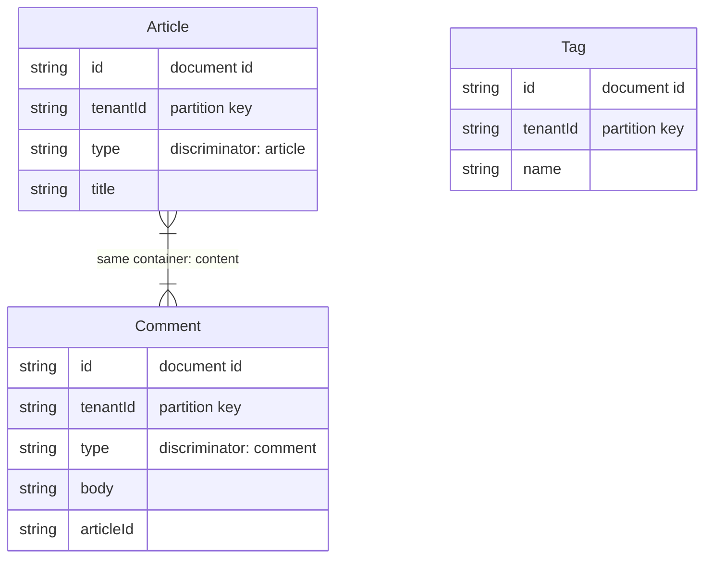

# Cosmio

[](https://github.com/masahirodev/cosmio/actions/workflows/ci.yml)
[](https://www.npmjs.com/package/cosmio)
[](https://opensource.org/licenses/MIT)
[](https://nodejs.org/)

Azure Cosmos DB 向けの型安全なモデル定義＆操作ライブラリ。
Zod スキーマからの型推論、階層パーティションキーの型安全なハンドリング、ドキュメント生成、OpenAPI 連携を提供します。

**[English documentation (README.md)](./README.md)**

## インストール

```bash
npm install cosmio zod @azure/cosmos
```

`zod` と `@azure/cosmos` は peerDependencies です。

### 推奨: `exactOptionalPropertyTypes`

`tsconfig.json` に以下を追加してください:

```jsonc
{
  "compilerOptions": {
    "exactOptionalPropertyTypes": true
  }
}
```

Azure Cosmos DB は `undefined` 値の書き込みを拒否します。必須フィールドは既に型安全です（`string` 型は `undefined` を受け付けません）。しかしオプショナルフィールド（`field?: string`）は、TypeScript のデフォルトでは `undefined` の明示的な代入を許容します。この設定により、コンパイル時に防止できます。

```ts
// exactOptionalPropertyTypes なし（デフォルト）
await users.create({ id: "1", bio: undefined }); // TSエラーなし → Azure が実行時に拒否

// exactOptionalPropertyTypes: true
await users.create({ id: "1", bio: undefined }); // TSエラー → コンパイル時に検出
await users.create({ id: "1" });                  // OK — フィールド省略
```

## クイックスタート

### 1. モデル定義

DB接続不要。純粋なデータ定義として使えます。

```ts
import { defineModel } from "cosmio";
import { z } from "zod";

const InspectionModel = defineModel({
  name: "Inspection",
  container: "inspections",
  partitionKey: ["/tenantId", "/siteId"],
  schema: z.object({
    id: z.string(),
    type: z.literal("inspection"),
    tenantId: z.string(),
    siteId: z.string(),
    name: z.string(),
    status: z.string(),
    createdAt: z.string(),
    updatedAt: z.string(),
  }),
  // defaults: 省略されたフィールドを自動で埋める
  defaults: {
    type: "inspection",                        // 静的な値
    status: "draft",
    createdAt: () => new Date().toISOString(),  // ファクトリ関数（毎回呼ばれる）
    updatedAt: () => new Date().toISOString(),
  },
  description: "点検情報の基本ドキュメント",
});

// 型の取り出し
type InspectionDoc = typeof InspectionModel._types.output;

// defaults のあるフィールドは入力時に省略可能
type InspectionInput = typeof InspectionModel._types.input;
// → { id: string; tenantId: string; siteId: string; name: string;
//      type?: string; status?: string; createdAt?: string; updatedAt?: string }
```

### 2. クライアント接続

```ts
import { CosmioClient } from "cosmio";

const client = new CosmioClient({
  cosmos: { endpoint: "https://xxx.documents.azure.com:443/", key: "..." },
  database: "mydb",
});

// モデルをバインド → 型安全な操作オブジェクト
const inspections = client.model(InspectionModel);
```

接続方法は3通り:

```ts
// エンドポイント + キー
{ cosmos: { endpoint: "...", key: "..." } }

// 接続文字列
{ cosmos: { connectionString: "AccountEndpoint=..." } }

// 既存の CosmosClient を渡す
{ cosmos: { client: existingCosmosClient } }
```

### 3. CRUD 操作

```ts
// Create — defaults で定義した type, status, createdAt, updatedAt は省略可能
const doc = await inspections.create({
  id: "insp-1",
  tenantId: "t1",
  siteId: "s1",
  name: "定期点検",
  // type, status, createdAt, updatedAt は defaults から自動で埋まる
});
// → { id: "insp-1", type: "inspection", status: "draft", createdAt: "2026-...", ... }

// もちろん明示的に渡せばそちらが優先される
const doc2 = await inspections.create({
  id: "insp-2",
  tenantId: "t1",
  siteId: "s1",
  name: "特別点検",
  status: "active",  // defaults の "draft" を上書き
});

// Read（PKタプルの型が自動チェックされる）
const found = await inspections.findById("insp-1", ["t1", "s1"]);
//                                                   ^^^^^^^^^ [string, string] が要求される

// Upsert
await inspections.upsert({ ...doc, name: "更新後" });

// Replace（ETag による楽観的並行制御）
await inspections.replace("insp-1", updatedDoc, { etag: doc._etag });

// Delete
await inspections.delete("insp-1", ["t1", "s1"]);

// Patch（部分更新）
await inspections.patch("insp-1", ["t1", "s1"], [
  { op: "replace", path: "/name", value: "新しい名前" },
]);

// 生SQL
const results = await inspections.query(
  "SELECT * FROM c WHERE c.name = @name",
  ["t1", "s1"],
);
```

### 4. Query Builder

```ts
const results = await inspections
  .find(["t1", "s1"])
  .where("name", "CONTAINS", "定期")
  .where("createdAt", ">=", "2025-01-01")
  .orderBy("createdAt", "DESC")
  .limit(10)
  .exec();
```

対応オペレータ: `=`, `!=`, `<`, `>`, `<=`, `>=`, `CONTAINS`, `STARTSWITH`, `ENDSWITH`, `ARRAY_CONTAINS`

### 5. マルチモデル・コンテナ共有

同一コンテナに複数モデルを格納する single-table design に対応:

```ts
const InspectionModel = defineModel({
  name: "Inspection",
  container: "documents",
  discriminator: { field: "type", value: "inspection" },
  partitionKey: ["/tenantId"],
  schema: z.object({
    id: z.string(),
    type: z.literal("inspection"),
    tenantId: z.string(),
    // ...
  }),
});

const ChecklistModel = defineModel({
  name: "Checklist",
  container: "documents",
  discriminator: { field: "type", value: "checklist" },
  partitionKey: ["/tenantId"],
  schema: z.object({
    id: z.string(),
    type: z.literal("checklist"),
    tenantId: z.string(),
    // ...
  }),
});
```

`discriminator` が設定されていると:

- Query Builder のクエリに自動で `WHERE c.type = "inspection"` が付加される
- `create` / `upsert` 時に discriminator フィールドの値が検証される

### 6. コンテナ管理

```ts
import { ensureContainer, ensureContainers } from "cosmio";

// 単一モデルのコンテナを作成（存在しなければ）
await ensureContainer(client.database, InspectionModel);

// 複数モデルをまとめて作成（コンテナ名で重複排除）
await ensureContainers(client.database, [InspectionModel, ChecklistModel], {
  throughput: 400,
});
```

### 7. デフォルト値

`defaults` を定義すると、`create` / `upsert` / `replace` / `bulk` 時にフィールドが未指定の場合に自動で値が埋まります。

```ts
const SessionModel = defineModel({
  name: "Session",
  container: "sessions",
  partitionKey: ["/userId"],
  schema: z.object({
    id: z.string(),
    userId: z.string(),
    status: z.string(),
    createdAt: z.string(),
    expiresAt: z.string(),
    loginCount: z.number(),
  }),
  defaults: {
    status: "active",                            // 静的な値
    createdAt: () => new Date().toISOString(),    // ファクトリ関数（毎回呼ばれる）
    expiresAt: () => {                           // 複雑なロジックも可
      const d = new Date();
      d.setHours(d.getHours() + 24);
      return d.toISOString();
    },
    loginCount: 0,
  },
});
```

**動作ルール:**
- フィールドが `undefined` の場合のみデフォルトが適用される
- 明示的に値を渡した場合はそちらが優先
- ファクトリ関数は `create` / `upsert` のたびに呼ばれる（`createdAt` 等に最適）
- 型レベルでも `defaults` に指定したフィールドは入力時に optional になる
- デフォルト適用後に Zod バリデーションが走るので、不正な値は弾かれる

### 8. マイグレーション

Cosmos DB はスキーマレスなので DB レベルのマイグレーションがありません。Cosmio では 2 つの方法でアプリ側のマイグレーションをサポートします。

#### 方法 A: グローバルマイグレーションレジストリ（推奨）

**1 箇所で定義すれば全モデルに自動適用**されます。

```ts
import { MigrationRegistry, CosmioClient } from "cosmio";

// 1. レジストリを作成（プロジェクトで1つ）
const migrations = new MigrationRegistry({ versionField: "_v" });

// 2. マイグレーションを登録（バージョン順に適用される）
migrations.register({
  name: "v2-merge-name",
  version: 2,
  up: (doc) => {
    if (doc.firstName && !doc.fullName) {
      doc.fullName = `${doc.firstName} ${doc.lastName}`;
      delete doc.firstName;
      delete doc.lastName;
    }
    return doc;
  },
});

migrations.register({
  name: "v3-default-role",
  version: 3,
  scope: { models: ["User"] },  // User モデルのみに適用
  up: (doc) => {
    if (!doc.role) doc.role = "member";
    return doc;
  },
});

// 3. クライアントに渡す — 全モデルの全読み取りに自動適用
const client = new CosmioClient({
  cosmos: { endpoint: "...", key: "..." },
  database: "mydb",
  migrations,
});
```

**動作:**
- ドキュメントの `_v`（または `_schemaVersion`）フィールドで現在のバージョンを追跡
- バージョンが古いドキュメントのみにマイグレーションが適用される
- `scope` でコンテナ名やモデル名でフィルタリング可能
- 適用順序はバージョン番号の昇順

#### 方法 B: モデル単位の `migrate`

個別のモデルにカスタムロジックを定義する場合:

```ts
const UserModel = defineModel({
  // ...
  migrate: (raw) => {
    if (!raw.fullName && raw.firstName) {
      raw.fullName = `${raw.firstName} ${raw.lastName}`;
    }
    return raw;
  },
});
```

**適用順序:** グローバルレジストリ → モデルの `migrate` → `validateOnRead`（有効な場合）

**適用タイミング:** `findById` / `query` / `find().exec()` / `patch` の全読み取り系メソッド

**`validateOnRead: true`** を有効にすると、migrate 後に Zod バリデーションも実行されます。

### 9. エラーハンドリング

Cosmos DB のステータスコードが型付きエラーにマッピングされます:

```ts
import {
  NotFoundError,
  ConflictError,
  ValidationError,
  CosmioError,
} from "cosmio";

try {
  await inspections.create(invalidDoc);
} catch (e) {
  if (e instanceof ValidationError) {
    console.log(e.issues); // Zod のバリデーションエラー詳細
  }
  if (e instanceof NotFoundError) {
    // 404
  }
  if (e instanceof ConflictError) {
    // 409（id重複など）
  }
}
```

| Status | Error Class | code |
|--------|-------------|------|
| 404 | `NotFoundError` | `NOT_FOUND` |
| 409 | `ConflictError` | `CONFLICT` |
| 412 | `PreconditionFailedError` | `PRECONDITION_FAILED` |
| 429 | `TooManyRequestsError` | `TOO_MANY_REQUESTS` |
| Zod | `ValidationError` | `VALIDATION_ERROR` |

### 10. ドキュメント生成

モデル定義からドキュメントを自動生成:

```ts
import { toJsonSchema, toOpenAPI, toMarkdownDoc } from "cosmio";

// JSON Schema
const jsonSchema = toJsonSchema(InspectionModel);
// → { $schema: "...", title: "Inspection", "x-cosmio-container": "inspections", ... }

// OpenAPI 3.1（CRUDパス付き）
const openapi = toOpenAPI([InspectionModel, ChecklistModel], {
  title: "My API",
  generatePaths: true,
});

// Markdown
const markdown = toMarkdownDoc([InspectionModel, ChecklistModel], {
  title: "モデル一覧",
});

// Mermaid ER図
const er = toMermaidER([InspectionModel, ChecklistModel], {
  title: "Cosmio Models",
});
```

### 11. モデル構成図（Mermaid）

`toMermaidER()` でモデル定義から Mermaid 形式のモデル構成図を生成できます。
Cosmos DB にはリレーショナル DB の FK はないため、**コンテナ単位のモデル配置**を可視化します。

```ts
import { toMermaidER } from "cosmio";

const diagram = toMermaidER([ArticleModel, CommentModel, TagModel], {
  title: "Cosmos DB Models",
});
```

出力例:



表示される情報:
- **document id**: ドキュメントの `id` フィールド
- **partition key**: パーティションキーフィールド（階層PKも対応）
- **discriminator**: single-table design での型識別子
- **same container**: 同一コンテナに格納されるモデル同士がリンクで結ばれる

### 12. Pull: DB からモデル自動生成

Cosmos DB コンテナのメタデータとサンプルドキュメントから `defineModel()` の TypeScript ファイルを自動生成します。

#### 設定ファイル (`cosmio.config.ts`)

```ts
import { defineConfig } from "cosmio";

export default defineConfig({
  connection: {
    endpoint: process.env.COSMOS_ENDPOINT,
    key: process.env.COSMOS_KEY,
    database: "mydb",
  },
  pull: [
    {
      container: "users",
      output: "src/models/user.model.ts",
      sampleSize: 100,
    },
    {
      container: "documents",
      where: "c.type = 'article'",
      name: "Article",
      output: "src/models/article.model.ts",
    },
  ],
});
```

#### 使い方

```bash
# config の全ターゲットを一括 pull
npx cosmio pull

# 特定コンテナだけ
npx cosmio pull --container=users

# config なし（CLI 引数 + 環境変数）
npx cosmio pull --endpoint=... --key=... --database=mydb --container=users --output=user.model.ts

# マルチモデルコンテナ: WHERE フィルタ
npx cosmio pull --container=documents --where="c.type = 'article'" --name=Article

# dotenvx と組み合わせ
dotenvx run -- npx cosmio pull

# エミュレータ
npx cosmio pull --disable-tls
```

**接続情報の優先順位:** CLI 引数 > `cosmio.config.ts` > 環境変数 (`COSMOS_ENDPOINT`, `COSMOS_KEY`, `COSMOS_CONNECTION_STRING`, `COSMOS_DATABASE`)

**生成される内容:**
- コンテナメタデータ（パーティションキー、インデックスポリシー、TTL、ユニークキー）を取得
- ドキュメントをサンプリングして Zod 型を推論（string, number, boolean, enum, literal, array, ネストオブジェクト）
- optional/nullable フィールド、enum、discriminator を自動検出
- そのまま使える `defineModel(...)` TypeScript ファイルを出力

全オプションは `npx cosmio pull --help` で確認できます。

### 13. CLI: ドキュメント生成

```bash
# Markdown ドキュメント生成
npx cosmio docs --format=markdown --output=./docs/models.md ./src/models/*.ts

# JSON Schema
npx cosmio docs --format=json-schema --output=./docs/schema.json ./src/models/*.ts

# OpenAPI
npx cosmio docs --format=openapi --output=./docs/openapi.json ./src/models/*.ts

# Mermaid ER図
npx cosmio docs --format=mermaid --output=./docs/er.md ./src/models/*.ts
```

CLI は `tsx` でTSファイルを動的に import し、export された `ModelDefinition` を自動収集します。

### 14. アクセスパターン分析 & 最適化提案

Cosmos DB はパーティション設計やインデックス設計がパフォーマンスとコストに直結します。Cosmio にはモデルとアクセスパターンを宣言的に定義し、ルールベース分析 + AI 提案を行うアドバイザー機能があります。

```ts
import { analyzeModels, generateAdvisorPrompt } from "cosmio";
import type { ModelWithPatterns } from "cosmio";

// アクセスパターンを定義
const inputs: ModelWithPatterns[] = [
  {
    model: UserModel,
    patterns: [
      {
        name: "テナントのユーザー一覧",
        operation: "query",
        rps: 50,
        fields: [
          { field: "tenantId", usage: "filter", operator: "=" },
          { field: "createdAt", usage: "sort" },
        ],
      },
      {
        name: "メールでユーザー検索",
        operation: "query",
        rps: 5,
        fields: [
          { field: "email", usage: "filter", operator: "=" },
        ],
      },
      {
        name: "ユーザー作成",
        operation: "create",
        rps: 2,
        avgDocumentSizeBytes: 1024,
      },
    ],
  },
];

// ルールベース分析
const report = analyzeModels(inputs);
console.log(report.summary);
// → "Analyzed 1 model(s) with 3 access pattern(s). Found 0 error(s), 1 warning(s), 1 suggestion(s). Estimated total: ~xxx RU/s."

for (const finding of report.findings) {
  console.log(`[${finding.severity}] ${finding.title}`);
  console.log(`  ${finding.recommendation}`);
}
```

**検出される問題:**

| カテゴリ | 検出内容 |
|----------|---------|
| `partition-key` | `id` をPKにしている、ホットパーティションの可能性 |
| `query` | パーティションキーなしのクエリ（クロスパーティション） |
| `indexing` | 除外パスが実際に使われている、composite index の提案 |
| `model` | 大きなドキュメント（>100KB）、共有コンテナに discriminator 未設定 |
| `cost` | RU/s の見積もり |

**AI Skills でさらに深い分析:**

```ts
// ルールベース分析の結果を含めた AI プロンプトを生成
const prompt = generateAdvisorPrompt(inputs, report);

// Claude や GPT に送信
const response = await anthropic.messages.create({
  model: "claude-sonnet-4-20250514",
  messages: [{ role: "user", content: prompt }],
});
// → パーティションキーの最適化提案、インデックス設計、コスト見積もり、
//   single-table design の提案などを AI が回答
```

プロンプトには以下が自動で含まれます:
- 全モデルの JSON Schema
- パーティションキー / インデックスポリシー / ユニークキー設定
- アクセスパターン一覧（RPS, フィールド使用状況）
- ルールベース分析の結果（findings + RU 見積もり）
- AI への具体的な質問項目（PK評価、インデックス最適化、コスト見積もり等）

## API 一覧

### `CosmioContainer` メソッド

| メソッド | 説明 |
|----------|------|
| `create(doc)` | 作成（Zodバリデーション付き） |
| `upsert(doc)` | 作成 or 置換 |
| `findById(id, pk)` | ポイントリード |
| `replace(id, doc, opts?)` | 全置換（etag対応） |
| `delete(id, pk)` | 削除 |
| `patch(id, pk, ops)` | 部分更新 |
| `query(sql, pk?)` | 生SQL |
| `find(pk?)` | Query Builder を返す |
| `bulk(ops)` | バルク操作 |
| `raw` | 生の Cosmos DB `Container` へのアクセス |

## 開発

```bash
npm install
npm run build       # tsup でビルド
npm test            # vitest でユニットテスト実行
npm run test:types  # 型レベルテスト
npm run typecheck   # tsc --noEmit
```

### 統合テスト（Cosmos DB エミュレータ）

Docker で Cosmos DB エミュレータを起動して、実際の CRUD・クエリ・階層PK・マルチモデル・バルク操作をテストできます。

```bash
# 1. エミュレータ起動
npm run emulator:up

# 2. ヘルスチェック（healthy になるまで待つ）
docker compose ps

# 3. 統合テスト実行
npm run test:integration

# 4. エミュレータ停止
npm run emulator:down
```

統合テストの内容:

| テストファイル | テスト内容 |
|----------------|-----------|
| `crud.test.ts` | create / findById / upsert / replace / patch / delete, バリデーションエラー, id重複 |
| `query-builder.test.ts` | where / orderBy / limit / CONTAINS / 生SQL |
| `hierarchical-pk.test.ts` | 階層パーティションキー `["/tenantId", "/siteId"]` での CRUD・クエリ |
| `multi-model.test.ts` | 同一コンテナに複数モデル格納, discriminator による自動フィルタリング |
| `bulk.test.ts` | バルク create / upsert / delete |

エミュレータは `mcr.microsoft.com/cosmosdb/linux/azure-cosmos-emulator:vnext-preview` を使用しています。データは永続化されません（テストごとにクリーン）。

```bash
# 全テスト一括実行（ユニット + 統合）
npm run test:all
```

## ライセンス

MIT
