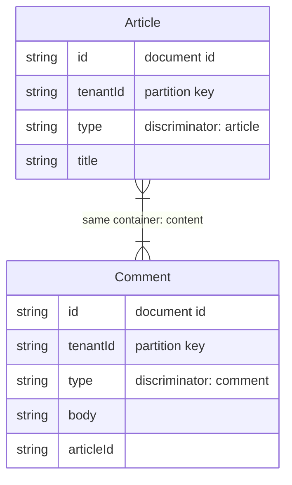

# Cosmio

[](https://github.com/masahirodev/cosmio/actions/workflows/ci.yml)
[](https://www.npmjs.com/package/cosmio)
[](https://opensource.org/licenses/MIT)
[](https://nodejs.org/)

Type-safe model definition and operation library for Azure Cosmos DB.
Zod-based schema inference, hierarchical partition key support, document generation, OpenAPI integration, and an AI-powered optimization advisor.

**[日本語ドキュメント (README.ja.md)](./README.ja.md)**

## Install

```bash
npm install cosmio zod @azure/cosmos
```

`zod` and `@azure/cosmos` are peer dependencies.

### Recommended: `exactOptionalPropertyTypes`

Add to your `tsconfig.json`:

```jsonc
{
  "compilerOptions": {
    "exactOptionalPropertyTypes": true
  }
}
```

Azure Cosmos DB rejects `undefined` values on write. Required fields are already type-safe (`string` does not accept `undefined`), but optional fields (`field?: string`) allow explicit `undefined` assignment by default in TypeScript. This setting closes that gap at compile time.

```ts
// Without exactOptionalPropertyTypes (default)
await users.create({ id: "1", bio: undefined }); // No TS error — but Azure rejects at runtime

// With exactOptionalPropertyTypes: true
await users.create({ id: "1", bio: undefined }); // TS error — caught at compile time
await users.create({ id: "1" });                  // OK — field omitted
```

## Quick Start

### 1. Define a Model

No DB connection required. Pure data definition.

```ts
import { defineModel } from "cosmio";
import { z } from "zod";

const InspectionModel = defineModel({
  name: "Inspection",
  container: "inspections",
  partitionKey: ["/tenantId", "/siteId"],
  schema: z.object({
    id: z.string(),
    type: z.literal("inspection"),
    tenantId: z.string(),
    siteId: z.string(),
    name: z.string(),
    status: z.string(),
    createdAt: z.string(),
    updatedAt: z.string(),
  }),
  defaults: {
    type: "inspection",                        // static value
    status: "draft",
    createdAt: () => new Date().toISOString(),  // factory function (called on each write)
    updatedAt: () => new Date().toISOString(),
  },
  description: "Inspection documents",
});

// Extract types
type InspectionDoc = typeof InspectionModel._types.output;

// Fields with defaults are optional in input
type InspectionInput = typeof InspectionModel._types.input;
// → { id: string; tenantId: string; siteId: string; name: string;
//      type?: string; status?: string; createdAt?: string; updatedAt?: string }
```

### 2. Connect

```ts
import { CosmioClient } from "cosmio";

const client = new CosmioClient({
  cosmos: { endpoint: "https://xxx.documents.azure.com:443/", key: "..." },
  database: "mydb",
});

// Bind a model → type-safe operations
const inspections = client.model(InspectionModel);
```

`CosmioClient` is a **singleton by default** (recommended by Azure for connection pool reuse). The same endpoint + database always returns the same instance.

Three connection methods:

```ts
// Endpoint + key
{ cosmos: { endpoint: "...", key: "..." } }

// Connection string
{ cosmos: { connectionString: "AccountEndpoint=..." } }

// Existing CosmosClient instance
{ cosmos: { client: existingCosmosClient } }
```

### 3. CRUD Operations

```ts
// Create — fields with defaults can be omitted
const doc = await inspections.create({
  id: "insp-1",
  tenantId: "t1",
  siteId: "s1",
  name: "Routine inspection",
  // type, status, createdAt, updatedAt auto-filled from defaults
});

// Explicit values override defaults
const doc2 = await inspections.create({
  id: "insp-2",
  tenantId: "t1",
  siteId: "s1",
  name: "Special inspection",
  status: "active",  // overrides default "draft"
});

// Read — PK tuple type is enforced: [string, string]
const found = await inspections.findById("insp-1", ["t1", "s1"]);

// Upsert
await inspections.upsert({ ...doc, name: "Updated" });

// Replace (with optimistic concurrency via ETag)
await inspections.replace("insp-1", updatedDoc, { etag: doc._etag });

// Delete
await inspections.delete("insp-1", ["t1", "s1"]);

// Patch (partial update)
await inspections.patch("insp-1", ["t1", "s1"], [
  { op: "replace", path: "/name", value: "New name" },
]);

// Raw SQL query
const results = await inspections.query(
  "SELECT * FROM c WHERE c.name = @name",
  ["t1", "s1"],
);
```

### 4. Query Builder

```ts
const results = await inspections
  .find(["t1", "s1"])
  .where("name", "CONTAINS", "routine")
  .where("createdAt", ">=", "2025-01-01")
  .orderBy("createdAt", "DESC")
  .limit(10)
  .exec();
```

Supported operators: `=`, `!=`, `<`, `>`, `<=`, `>=`, `CONTAINS`, `STARTSWITH`, `ENDSWITH`, `ARRAY_CONTAINS`

### 5. Multi-Model Containers

Single-table design with multiple models in one container:

```ts
const InspectionModel = defineModel({
  name: "Inspection",
  container: "documents",
  discriminator: { field: "type", value: "inspection" },
  partitionKey: ["/tenantId"],
  schema: z.object({
    id: z.string(),
    type: z.literal("inspection"),
    tenantId: z.string(),
    // ...
  }),
});

const ChecklistModel = defineModel({
  name: "Checklist",
  container: "documents",
  discriminator: { field: "type", value: "checklist" },
  partitionKey: ["/tenantId"],
  schema: z.object({
    id: z.string(),
    type: z.literal("checklist"),
    tenantId: z.string(),
    // ...
  }),
});
```

When `discriminator` is set:
- Query Builder auto-appends `WHERE c.type = "inspection"`
- `create` / `upsert` validate the discriminator field value

### 6. Container Management

```ts
import { ensureContainer, ensureContainers } from "cosmio";

// Create container if not exists
await ensureContainer(client.database, InspectionModel);

// Multiple models (deduplicates by container name)
await ensureContainers(client.database, [InspectionModel, ChecklistModel], {
  throughput: 400,
});
```

Container settings supported in `defineModel`:

| Setting | Option | Description |
|---------|--------|-------------|
| Indexing | `indexingPolicy` | Cosmos DB IndexingPolicy format |
| TTL | `defaultTtl` | Auto-expire documents (`-1` enables per-doc TTL) |
| Unique keys | `uniqueKeyPolicy` | Per-partition field uniqueness |
| Conflict resolution | `conflictResolutionPolicy` | Multi-region write conflict handling |

### 7. Defaults

Auto-fill fields on `create` / `upsert` / `replace` / `bulk` when values are not provided.

```ts
const SessionModel = defineModel({
  name: "Session",
  container: "sessions",
  partitionKey: ["/userId"],
  schema: z.object({
    id: z.string(),
    userId: z.string(),
    status: z.string(),
    createdAt: z.string(),
    expiresAt: z.string(),
    loginCount: z.number(),
  }),
  defaults: {
    status: "active",                            // static value
    createdAt: () => new Date().toISOString(),    // factory (called per write)
    expiresAt: () => {                           // complex logic
      const d = new Date();
      d.setHours(d.getHours() + 24);
      return d.toISOString();
    },
    loginCount: 0,
  },
});
```

**Rules:**
- Applied only when the field value is `undefined`
- Explicit values always take precedence
- Factory functions are called on every write
- Fields with defaults become optional in the TypeScript input type
- Zod validation runs after defaults are applied

### 8. Migrations

Cosmos DB has no built-in schema migrations. Cosmio provides two approaches for app-level migrations.

#### Method A: Global Migration Registry (Recommended)

**Define once, auto-applied to all reads across all models.**

```ts
import { MigrationRegistry, CosmioClient } from "cosmio";

// 1. Create registry (one per project)
const migrations = new MigrationRegistry({ versionField: "_v" });

// 2. Register migrations (applied in version order)
migrations.register({
  name: "v2-merge-name",
  version: 2,
  up: (doc) => {
    if (doc.firstName && !doc.fullName) {
      doc.fullName = `${doc.firstName} ${doc.lastName}`;
      delete doc.firstName;
      delete doc.lastName;
    }
    return doc;
  },
});

migrations.register({
  name: "v3-default-role",
  version: 3,
  scope: { models: ["User"] },  // applies only to User model
  up: (doc) => {
    if (!doc.role) doc.role = "member";
    return doc;
  },
});

// 3. Pass to client — auto-applied to all reads
const client = new CosmioClient({
  cosmos: { endpoint: "...", key: "..." },
  database: "mydb",
  migrations,
});
```

**How it works:**
- Tracks schema version via `_v` (or `_schemaVersion`) field on each document
- Only applies migrations newer than the document's version
- `scope` filters by container name or model name
- Applied in ascending version order

#### Method B: Per-Model `migrate`

Custom logic for individual models:

```ts
const UserModel = defineModel({
  // ...
  migrate: (raw) => {
    if (!raw.fullName && raw.firstName) {
      raw.fullName = `${raw.firstName} ${raw.lastName}`;
    }
    return raw;
  },
});
```

**Execution order:** Global Registry → Model `migrate` → `validateOnRead` (if enabled)

**Applied to:** `findById` / `query` / `find().exec()` / `patch` return values

Set `validateOnRead: true` to run Zod validation after migration.

### 9. Error Handling

Cosmos DB status codes are mapped to typed errors:

```ts
import {
  NotFoundError,
  ConflictError,
  ValidationError,
  CosmioError,
} from "cosmio";

try {
  await inspections.create(invalidDoc);
} catch (e) {
  if (e instanceof ValidationError) {
    console.log(e.issues); // Zod validation error details
  }
  if (e instanceof NotFoundError) { /* 404 */ }
  if (e instanceof ConflictError) { /* 409 - duplicate id */ }
}
```

| Status | Error Class | Code |
|--------|-------------|------|
| 404 | `NotFoundError` | `NOT_FOUND` |
| 409 | `ConflictError` | `CONFLICT` |
| 412 | `PreconditionFailedError` | `PRECONDITION_FAILED` |
| 429 | `TooManyRequestsError` | `TOO_MANY_REQUESTS` |
| Zod | `ValidationError` | `VALIDATION_ERROR` |

### 10. Document Generation

Auto-generate documentation from model definitions:

```ts
import { toJsonSchema, toOpenAPI, toMarkdownDoc, toMermaidER } from "cosmio";

// JSON Schema
const jsonSchema = toJsonSchema(InspectionModel);

// OpenAPI 3.1 (with CRUD paths)
const openapi = toOpenAPI([InspectionModel, ChecklistModel], {
  title: "My API",
  generatePaths: true,
});

// Markdown
const markdown = toMarkdownDoc([InspectionModel, ChecklistModel]);

// Mermaid ER diagram
const er = toMermaidER([InspectionModel, ChecklistModel]);
```

### 11. Model Diagram (Mermaid)

`toMermaidER()` generates Mermaid ER diagrams showing container-level model layout.
Since Cosmos DB has no foreign keys, it visualizes **container grouping** instead.



Annotations: **document id**, **partition key**, **discriminator**, **same container** links.

### 12. Pull: Generate Models from DB

Introspect a Cosmos DB container and auto-generate a `defineModel()` TypeScript file from its metadata and sampled documents.

#### Config File (`cosmio.config.ts`)

```ts
import { defineConfig } from "cosmio";

export default defineConfig({
  connection: {
    endpoint: process.env.COSMOS_ENDPOINT,
    key: process.env.COSMOS_KEY,
    database: "mydb",
  },
  pull: [
    {
      container: "users",
      output: "src/models/user.model.ts",
      sampleSize: 100,
    },
    {
      container: "documents",
      where: "c.type = 'article'",
      name: "Article",
      output: "src/models/article.model.ts",
    },
  ],
});
```

#### Usage

```bash
# Pull all targets from config
npx cosmio pull

# Pull a specific container
npx cosmio pull --container=users

# Without config (CLI args + env vars)
npx cosmio pull --endpoint=... --key=... --database=mydb --container=users --output=user.model.ts

# Multi-model container with WHERE filter
npx cosmio pull --container=documents --where="c.type = 'article'" --name=Article

# With dotenvx
dotenvx run -- npx cosmio pull

# Emulator
npx cosmio pull --disable-tls
```

**Connection priority:** CLI args > `cosmio.config.ts` > env vars (`COSMOS_ENDPOINT`, `COSMOS_KEY`, `COSMOS_CONNECTION_STRING`, `COSMOS_DATABASE`)

**What it generates:**
- Reads container metadata (partition key, indexing policy, TTL, unique keys)
- Samples documents and infers Zod types (string, number, boolean, enum, literal, array, nested objects)
- Detects optional/nullable fields, enums, and discriminators
- Outputs a ready-to-use `defineModel(...)` TypeScript file

Run `npx cosmio pull --help` for all options.

### 13. CLI: Docs

```bash
# Markdown
npx cosmio docs --format=markdown --output=./docs/models.md ./src/models/*.ts

# JSON Schema
npx cosmio docs --format=json-schema --output=./docs/schema.json ./src/models/*.ts

# OpenAPI
npx cosmio docs --format=openapi --output=./docs/openapi.json ./src/models/*.ts

# Mermaid
npx cosmio docs --format=mermaid --output=./docs/er.md ./src/models/*.ts
```

### 14. Access Pattern Analysis & Optimization Advisor

Cosmos DB performance and cost depend heavily on partition key and indexing design. Cosmio includes a rule-based analyzer + AI-powered advisor.

```ts
import { analyzeModels, generateAdvisorPrompt } from "cosmio";
import type { ModelWithPatterns } from "cosmio";

// Declare access patterns
const inputs: ModelWithPatterns[] = [
  {
    model: UserModel,
    patterns: [
      {
        name: "List tenant users",
        operation: "query",
        rps: 50,
        fields: [
          { field: "tenantId", usage: "filter", operator: "=" },
          { field: "createdAt", usage: "sort" },
        ],
      },
      {
        name: "Search by email",
        operation: "query",
        rps: 5,
        fields: [{ field: "email", usage: "filter", operator: "=" }],
      },
    ],
  },
];

// Rule-based analysis
const report = analyzeModels(inputs);
console.log(report.summary);

for (const finding of report.findings) {
  console.log(`[${finding.severity}] ${finding.adviceId}: ${finding.title}`);
  console.log(`  → ${finding.recommendation}`);
}
```

**Detected issues (Azure Advisor categories):**

| Category | Detections |
|----------|-----------|
| Cost | Default indexing policy, large documents, monthly cost estimate |
| Performance | `id` as PK, cross-partition queries, composite index suggestions |
| Reliability | Shared container without discriminator |
| Operational Excellence | High write rate without TTL |

**Design pattern recommendations** from [Azure Cosmos DB Design Patterns](https://github.com/Azure-Samples/cosmos-db-design-patterns):

Materialized View, Schema Versioning, Event Sourcing, Data Binning, Distributed Counter, Document Versioning, Attribute Array — recommended automatically based on access patterns.

**AI-powered deep analysis:**

```ts
const prompt = generateAdvisorPrompt(inputs, report);

// Send to Claude, GPT, etc.
const response = await anthropic.messages.create({
  model: "claude-sonnet-4-20250514",
  messages: [{ role: "user", content: prompt }],
});
```

The prompt includes: model schemas, partition keys, indexing policies, access patterns, RU estimates, cost breakdowns, and structured questions following the Azure Advisor framework.

### 15. Azure Functions Integration

Automatic per-invocation caching via `AsyncLocalStorage`. Register once — all functions get request-scoped caching with zero manual `scope()` calls.

```ts
// src/functions/index.ts
import { app } from "@azure/functions";
import { cosmioHooks } from "cosmio";

// Register once
cosmioHooks(app);
```

```ts
// src/functions/getUser.ts
app.http("getUser", {
  handler: async (req, context) => {
    // No scope() needed — cache is automatic per invocation
    const user = await users.findById("u1", ["t1"]);  // DB hit
    const same = await users.findById("u1", ["t1"]);  // cached (0 RU)

    // Query results are also cached within the same invocation
    const list = await users.find(["t1"]).where({ role: "admin" }).exec();  // DB hit
    const list2 = await users.find(["t1"]).where({ role: "admin" }).exec(); // cached

    return { jsonBody: user };
  },
});
```

**Azure Functions v3:**

```ts
// Azure Functions v3 (Node.js programming model v3)
import { cosmioV3 } from "cosmio";

module.exports = cosmioV3(async function (context, req) {
  // Cache is automatic — invocationId is extracted from context
  const user = await users.findById("u1", ["t1"]);  // DB hit
  const same = await users.findById("u1", ["t1"]);  // cached (0 RU)

  // Query results are also cached
  const list = await users.find(["t1"]).where({ role: "admin" }).exec();

  context.res = { body: user };
});
```

**Other frameworks** (Express, Hono, etc.):

```ts
import { withCosmioContext } from "cosmio";

// Express / Hono / any framework
app.use((req, res, next) => {
  withCosmioContext(() => next());
});
```

### 16. Field Descriptions

Use Zod's `.describe()` to add field descriptions. They are extracted and available at runtime for documentation generation:

```ts
const UserModel = defineModel({
  name: "User",
  container: "users",
  partitionKey: ["/tenantId"],
  schema: z.object({
    id: z.string().describe("Unique document identifier"),
    tenantId: z.string().describe("Tenant partition key"),
    name: z.string().describe("User display name"),
    email: z.string().email().describe("Login email address"),
  }),
});

// Access at runtime
UserModel.fieldDescriptions.id;    // → "Unique document identifier"
UserModel.fieldDescriptions.email;  // → "Login email address"
```

Descriptions are also included in JSON Schema, Markdown, and OpenAPI output.

## API Reference

### `CosmioContainer` Methods

| Method | Description |
|--------|-------------|
| `create(doc)` | Create with Zod validation |
| `upsert(doc)` | Create or replace |
| `findById(id, pk)` | Point read |
| `replace(id, doc, opts?)` | Full replace (ETag support) |
| `delete(id, pk)` | Delete |
| `patch(id, pk, ops)` | Partial update |
| `query(sql, pk?)` | Raw SQL query |
| `find(pk?)` | Returns a Query Builder |
| `findWithDeleted(pk?)` | Query including soft-deleted docs |
| `bulk(ops)` | Bulk operations |
| `hardDelete(id, pk)` | Physical delete (bypass soft delete) |
| `restore(id, pk)` | Restore a soft-deleted document |
| `scope()` | Request-scoped cache wrapper |
| `use(event, fn)` | Register lifecycle hook |
| `raw` | Access underlying Cosmos DB Container |

## Development

```bash
npm install
npm run build       # Build with tsup (ESM + CJS)
npm test            # Unit tests (vitest)
npm run test:types  # Type-level tests
npm run typecheck   # tsc --noEmit
npm run check       # Biome lint + format
```

### Integration Tests (Cosmos DB Emulator)

Run real CRUD, queries, hierarchical PK, multi-model, and bulk operations against a Docker-based emulator.

```bash
npm run emulator:up        # Start Cosmos DB emulator
npm run test:integration   # Run integration tests
npm run emulator:down      # Stop emulator
npm run test:all           # All tests (unit + integration)
```

| Test file | Coverage |
|-----------|----------|
| `crud.test.ts` | create / findById / upsert / replace / patch / delete, validation, conflicts |
| `query-builder.test.ts` | where / orderBy / limit / CONTAINS / raw SQL |
| `hierarchical-pk.test.ts` | Hierarchical partition key CRUD & queries |
| `multi-model.test.ts` | Same-container multi-model, discriminator filtering |
| `bulk.test.ts` | Bulk create / upsert / delete |

Emulator image: `mcr.microsoft.com/cosmosdb/linux/azure-cosmos-emulator:vnext-preview`

## License

MIT
