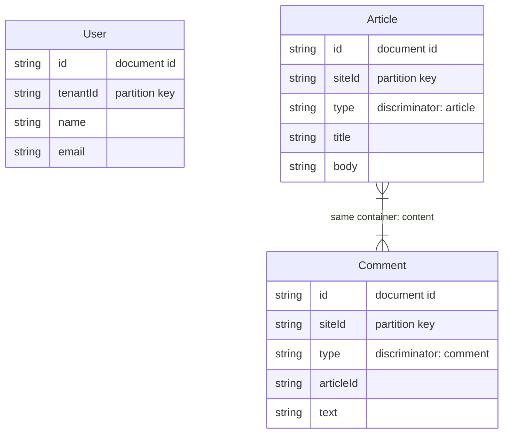

Generate Mermaid ER diagrams from Cosmio models. Models sharing the same container are visually linked.

## Basic Usage

```ts
import { toMermaidER } from "cosmio";

const diagram = toMermaidER([UserModel, ArticleModel, CommentModel]);
console.log(diagram);
```

Output:



## Container Grouping

Models sharing the same container are connected with a relationship line. This visualizes your single-table design:

```ts
// Article and Comment share "content" container
// User is in its own "users" container
// → Article and Comment are linked, User stands alone
```

## Diagram Title

```ts
const diagram = toMermaidER([UserModel, OrderModel], {
  title: "E-Commerce Data Model",
});
```

Output:

```mermaid
---
title: E-Commerce Data Model
---
erDiagram
  ...
```

## Field Annotations

Fields are automatically annotated:

| Annotation | When |
|-----------|------|
| `document id` | Field named `id` |
| `partition key` | Field matches a partition key path |
| `discriminator: value` | Field is the discriminator |
| `optional` | Field is optional in the schema |

## No FK Concept

Cosmos DB is a document database without foreign keys. The ER diagram shows document structures and container co-location, not relational links. Use it as a visualization of your data model layout.

## CLI

```bash
# Output to stdout
npx cosmio docs --format=mermaid src/models/*.ts

# Write to file
npx cosmio docs --format=mermaid --output=docs/er.mmd src/models/*.ts
```

## Programmatic Write

```ts
import { writeFileSync } from "node:fs";

const diagram = toMermaidER(models, { title: "My Models" });
writeFileSync("models.mmd", diagram);
```
