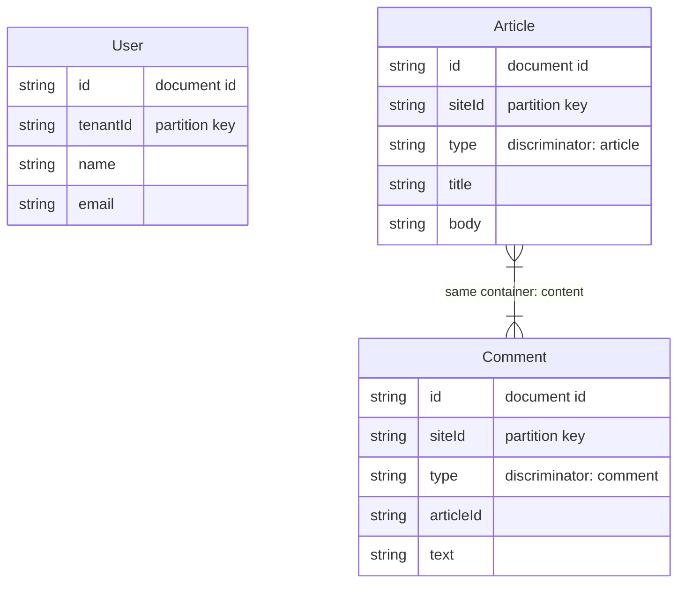

CosmioモデルからMermaid ER図を生成します。同じコンテナを共有するモデルは視覚的にリンクされます。

## 基本的な使い方

```ts
import { toMermaidER } from "cosmio";

const diagram = toMermaidER([UserModel, ArticleModel, CommentModel]);
console.log(diagram);
```

出力：



## コンテナグルーピング

同じコンテナを共有するモデルはリレーションシップ線で接続されます。シングルテーブル設計を視覚化できます：

```ts
// Article と Comment は "content" コンテナを共有
// User は独自の "users" コンテナ
// → Article と Comment がリンクされ、User は単独
```

## 図のタイトル

```ts
const diagram = toMermaidER([UserModel, OrderModel], {
  title: "E-Commerce Data Model",
});
```

## フィールド注釈

フィールドには自動的に注釈が付与されます：

| 注釈 | 条件 |
|------|------|
| `document id` | フィールド名が `id` |
| `partition key` | パーティションキーパスに一致するフィールド |
| `discriminator: value` | ディスクリミネータフィールド |
| `optional` | スキーマ上オプショナルなフィールド |

## FKの概念なし

Cosmos DBは外部キーを持たないドキュメントデータベースです。ER図はドキュメント構造とコンテナの同居関係を示すもので、リレーショナルなリンクではありません。データモデルレイアウトの視覚化ツールとしてご利用ください。

## CLI

```bash
npx cosmio docs --format=mermaid src/models/*.ts
npx cosmio docs --format=mermaid --output=er.mmd src/models/*.ts
```

## プログラム的な書き出し

```ts
import { writeFileSync } from "node:fs";

const diagram = toMermaidER(models, { title: "My Models" });
writeFileSync("models.mmd", diagram);
```
